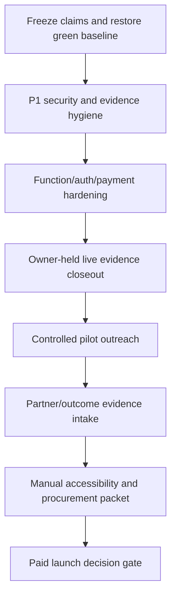

# Commercial Launch Readiness Deep Research Plan

Generated: 2026-06-04
Audit target: `/Users/sanjayb/Documents/newrepo/career-automation-insights-engine`
Mode: phased safe implementation in progress
Decision: `blocked` for paid/commercial-ready launch; `pilot-only` for controlled founder-led demos with explicit caveats

## 0. Scope Boundary

The Mail attachment path supplied by the active thread,
`/Users/sanjayb/Library/Containers/com.apple.Notes/Data/tmp/com.apple.mail.SavedAttachment-T0x60002020c2c0.tmp.7z615v/career-automation-insights-org`,
is a hollow snapshot: empty `src`, `public`, `.git`, `.bolt`, and `node_modules` directory structures, plus only `supabase/.temp/cli-latest`.

The actual one-repo checkout used for this plan is:
`/Users/sanjayb/Documents/newrepo/career-automation-insights-engine`.

No deploys, migrations, live credential tests, payment actions, deletes, or outreach were performed. Safe repo-side fixes are now being applied phase by phase.

## 1. Repo-First Evidence Baseline

| Surface | Evidence | Proof Bucket | Finding |
|---|---|---|---|
| Stack | `package.json`, `src/App.tsx`, `supabase/functions`, `netlify.toml` | Repo artifact | Vite, React, TypeScript, shadcn/Tailwind, Supabase Edge Functions, Stripe, Whop, Gemini, PostHog, Netlify. |
| Git state | `git status --short --branch` | Local | Current branch is `main...origin/main`; the worktree intentionally contains the launch-readiness edits listed in the fix report plus this untracked plan artifact. |
| Routes | `src/App.tsx`; `npm run smoke:commercial`; Playwright browser smoke | Local | Commercial routes render after route-shell lazy loading: `/`, `/proof-pack-gallery`, `/trust-center`, `/pricing`, `/auth`, `/operations/leads`, and others. |
| Build | `npm run build` | Local | Passes after chunking fix; the >500 kB JS chunk warning and mixed Supabase static/dynamic chunk warning are gone. Stale Browserslist data remains a maintenance warning. |
| Static quality | `npm run lint`; `npx tsc --noEmit` | Local | Both passed. |
| Secrets scan | `npm run verify:secrets` | Local | Passed for tracked high-confidence secret patterns. |
| Claim boundaries | `npm run verify:claim-boundaries` | Local | Passed after rewording the blocked APO validation claim label. |
| External gates | `npm run verify:remediation-gates` | Local | Passed verifier, but `goalComplete=false`; missing live/commercial owner-held evidence remains. |
| Dependency audit | `npm audit --omit=dev --audit-level=moderate` | Local/current registry | Found 0 production vulnerabilities after upgrading `react-router-dom` / `react-router` to 6.30.4. |
| Browser proof | Playwright via Node REPL at `http://127.0.0.1:5174` | Local/browser | Home, proof-pack gallery, pricing, trust center, and auth returned 200 and rendered meaningful headings after lazy route-shell changes. |

## 2. External Best-Practice Baseline

Use the current external standards below as the control map for the execution phase:

- OWASP Top 10:2025: access control, supply chain, logging/alerting, and exceptional-condition handling are directly relevant to this app. Source: https://owasp.org/Top10/2025/0x00_2025-Introduction/
- OWASP ASVS 5.0.0: use ASVS as the detailed application security verification checklist, not just OWASP Top 10. Source: https://owasp.org/www-project-application-security-verification-standard/
- OWASP API Security Top 10 2023: public Edge Functions map especially to API1, API3, API4, API5, API6, API8, and API9. Source: https://owasp.org/API-Security/editions/2023/en/0x11-t10/
- NIST SSDF SP 800-218: convert launch readiness into repeatable secure development practices and vulnerability-response proof. Source: https://csrc.nist.gov/pubs/sp/800/218/final
- CISA Secure by Design: paid launch should emphasize secure defaults, transparency, logging, and ownership of customer security outcomes. Source: https://www.cisa.gov/securebydesign
- Supabase RLS docs: all exposed-schema tables need RLS and policies, especially because browser clients use publishable keys. Source: https://supabase.com/docs/guides/database/postgres/row-level-security
- Supabase Edge Function auth docs: keep `verify_jwt` enabled for user-JWT functions; public functions need their own signature/rate/origin/cost controls. Source: https://supabase.com/docs/guides/functions/auth-headers
- Stripe webhook docs: signed webhooks must verify the raw request body and endpoint secret before trusting events. Source: https://docs.stripe.com/webhooks?lang=node
- NIST AI RMF and GenAI Profile: APO and Gemini outputs need explainability, uncertainty, privacy, monitoring, and misuse boundaries. Source: https://www.nist.gov/itl/ai-risk-management-framework
- OWASP LLM/GenAI risks: prompt injection, sensitive information disclosure, model output trust, and embedding/vector risks apply to Gemini-backed functions. Source: https://genai.owasp.org/
- WEF Future of Jobs 2025 and ILO GenAI Jobs 2025: strong market demand exists for task-level AI exposure, reskilling, and workforce-transition planning, but claims must stay decision-support only. Sources: https://www.weforum.org/reports/the-future-of-jobs-report-2025/ and https://www.ilo.org/publications/generative-ai-and-jobs-2025-update

## 3. Launch Score

| Dimension | Score / 5 | Evidence | Caveat |
|---|---:|---|---|
| Security | 3 | Secret scan, trust verifier, JWT checkout source, governance registry. | Public/no-JWT function portfolio, client-visible API-key examples, live rate/cost proof gaps, and function-cap blocker remain. |
| Readiness | 3 | Build, lint, TypeScript, commercial smoke, browser smoke pass. | Live gates are not complete; CI/live production proof was not inspected in this phase. |
| Sellability | 3 | Proof-pack gallery, coach sample, pricing, lead ops, trust center render locally. | Revenue, partners, outcomes, production checkout, and scientific validation remain unproven. |
| Evidence | 3 | Strong repo artifacts and local verifiers. | Owner-held live evidence records are missing; `goalComplete=false`. |
| Overall | 3 | Controlled demos are credible. | Commercial-ready launch is blocked. |

## 4. Gap Analysis

| Gap | Severity | Evidence | Framework Mapping | Buyer Impact | Fix/Action | Status |
|---|---|---|---|---|---|---|
| Unsupported scientific-validation phrase triggers verifier | P1 | `verify:claim-boundaries` now passes after `src/lib/commercialLaunchReadiness.ts` label repair. | NIST AI RMF; OWASP Top 10 A06 insecure design | Trust center can show blocked evidence without causing the claim scanner to fail. | Rename blocked claim to avoid banned absolute phrasing while preserving the warning. | Done |
| `VITE_` secret-class env examples | P1 | `.env.example`, frontend APO callers, Whop config, and `verify-secret-hygiene.mjs` were hardened. | OWASP Top 10 A03/A04/A07; CISA Secure by Design | Reduces operator risk of bundling server secrets into browser builds. | Split browser-public vs server-only env docs and add a verifier for forbidden browser-public secret env names. | Done |
| Public/no-JWT function portfolio | P1 | `supabase/config.toml`; `src/lib/supabaseFunctionGovernance.ts` | OWASP API1/API4/API5/API6/API9 | Buyers will block paid use without auth/rate/cost/origin evidence. | Harden or retire by slug; attach live rejection/rate telemetry before paid use. | Open |
| Checkout and portal return-origin trust | P1 | `create-checkout-session`, `create-portal-session`, `create-credit-checkout`, and commercial-trust verifier now include origin allowlist checks. | OWASP API5/API8; Stripe redirect integrity | Prevents future deployed payment flows from reflecting arbitrary browser origins into Stripe return URLs. | Allow configured app origins plus localhost; reject disallowed browser origins; preserve server-side fallback to `APP_URL`. | Done in source; live redeploy still gated |
| Payment proof incomplete | P1 | `verify:remediation-gates`: Stripe checkout blocked by non-test key; live MRR missing | Stripe docs; OWASP API8 | Cannot sell paid launch without test/live reconciliation. | Owner supplies test/live Stripe evidence; run fail-closed closeout. | Owner gate |
| Function-cap/deployment blocker | P1 | `commercialLaunchGate.ts` notes Supabase 402 function-count cap | CISA transparency; SSDF release practice | Latest checkout/webhook source may not be live. | Retire legacy slugs after approval or raise cap, redeploy, replay webhook. | Owner/staff gate |
| Missing partner/outcome evidence | P1 | `verify:remediation-gates`: 0 accepted partner/outcome records | WEF/ILO market proof discipline | Outreach must stay pilot-only; no traction claims. | Capture redacted owner-held records with hashes and permissioned outcome text. | Owner gate |
| React Router moderate advisory | P2 | `package.json`, `package-lock.json`, `npm audit --omit=dev --audit-level=moderate`; GHSA-2j2x-hqr9-3h42 | OWASP A03 supply chain | Removes a moderate same-origin redirect supply-chain advisory from the production dependency graph. | Upgraded to patched `react-router-dom`/`react-router` 6.30.4 and regression-tested build, smoke, and browser-rendered routes. | Done |
| In-memory rate limits | P2 | `supabase/lib/RateLimiter.ts` says production should use durable store | OWASP API4 | Public LLM/API cost controls may reset per edge instance. | Move critical public endpoints to durable rate/cost counters or provider-level controls. | Open |
| Browser performance/chunk warning | P2 | `src/App.tsx`, `src/contexts/WhopAppContext.tsx`, `vite.config.ts`, `npm run build`, `find dist/assets -size +500k` | Readiness/perf | Improves demo polish and removes a production build warning before buyer-facing pilots. | Lazy-load home/auth/assistant shell code, defer Whop Supabase sync import, and split shared vendor chunks. | Done |
| Manual accessibility evidence missing | P2 | `scripts/verify-commercial-accessibility.mjs`, `docs/commercialization/commercial-accessibility-audit-latest.md`, `src/pages/EnterpriseTeamDashboard.tsx`, `src/components/ui/checkbox.tsx`, `src/components/ResumeAnalyzer.tsx`, `src/pages/ResponsibleAIPage.tsx`, `src/pages/ProofPackGalleryPage.tsx` | WCAG 2.2/ASVS UX-adjacent trust | Gives buyers stronger keyboard/focus/reflow evidence while avoiding a false WCAG conformance claim. | Extended the a11y verifier, regenerated the WCAG packet, fixed workforce dashboard chart SVG tab stops with screen-reader summaries, enlarged checkbox targets, corrected the resume upload dropzone review target, and contained wide audit tables under text-spacing stress. | Browser-assisted evidence done with no target-size or text-spacing residuals; AT/contrast/manual conformance still gated |

## 5. Proof Buckets

| Bucket | Evidence | Claim Allowed |
|---|---|---|
| Hosted/live | Not verified in this phase. Remediation gates show missing owner-held live evidence. | No hosted launch claim. |
| Local | Build, lint, typecheck, secret scan, commercial smoke, browser smoke, trust/gov verifiers. | Local implementation and demo readiness claims. |
| Repo artifact | README, STATUS, proof-pack gallery, trust center, Supabase functions/migrations, verifiers. | Design intent, implementation presence, and proof-boundary discipline. |
| Candidate/shadow | Owner evidence templates, skipped Stripe/calibration artifacts, function retirement plans. | Roadmap or pending proof only. |
| Roadmap | Paid launch, live MRR, partners, outcomes, production calibration scale, licensed data adapters. | Do not use as launch claims. |

## 6. Top 10 Buyer Pain Points

| Rank | Pain Point | Affected Buyer | Source Evidence | WTP Signal | Repo Proof Fit | Confidence |
|---:|---|---|---|---|---|---:|
| 1 | Leaders need role-level AI exposure without making layoff claims. | HR/L&D, workforce planning | WEF 2025; ILO 2025 | Workforce transformation budgets | APO, proof-pack, trust center | 4 |
| 2 | Coaches need credible artifacts clients can understand. | Career coaches/outplacement | WEF skills disruption | Paid coaching/report products | Coach sample, counselor reports | 4 |
| 3 | Institutions need evidence-safe student/career-center materials. | Community colleges/career centers | WEF reskilling pressure | Program and grant reporting needs | Career-center cohort proof pack | 3 |
| 4 | Employers need skill-gap and transition plans, not just risk scores. | L&D/talent mobility | WEF skills gap; ILO task approach | Reskilling spend | Bridge roles, skill adjacency | 4 |
| 5 | Buyers need proof boundaries for AI advice. | Compliance/procurement | NIST AI RMF; OWASP GenAI | AI governance review | Responsible AI/trust pages | 4 |
| 6 | Paid reports need privacy/redaction guarantees. | Coaches, career centers | OWASP/ASVS; CISA | Procurement and student/employee privacy | Resume proof report redaction/deletion receipts | 3 |
| 7 | Public demos need cost controls. | SaaS operator/founder | OWASP API4 | Margin protection | Rate limiter and governance registry | 3 |
| 8 | Stripe/Whop checkout must prove fulfillment. | Coaches/individual subscribers | Stripe docs | Direct revenue | Checkout source and proof gates | 3 |
| 9 | Local labor-market claims need source freshness. | Workforce boards, institutions | WEF/ILO plus source manifests | Regional budgets | Source registry/global-English adapters | 3 |
| 10 | Pilot outreach needs CRM-grade tracking without overclaiming. | Founder/sales lead | CISA transparency; market proof norms | Pipeline conversion | Commercial lead ops | 3 |

## 7. Top 10 Target Segments

| Rank | Segment | Pain | Trigger | Decision Maker | Outreach Angle | Proof To Show | Confidence |
|---:|---|---|---|---|---|---|---:|
| 1 | Independent career coaches serving mid-career professionals | Need differentiated AI-era reports | Client churn or AI anxiety | Founder/coach | "Decision-support proof pack, not a fear score" | Coach sample report | 4 |
| 2 | Outplacement boutiques | Need scalable transition plans | Layoff support contracts | Managing partner | "Role-to-role transition artifact with caveats" | Bridge roles + sample report | 4 |
| 3 | Community college career centers | Need AI impact guidance | Grant/workforce program push | Career services director | "Planning-only cohort proof pack" | Career-center cohort pack | 3 |
| 4 | Workforce boards | Need occupation exposure and reskilling maps | Regional AI workforce programs | Program director | "Source-labeled local workforce planning" | Market map + source manifest | 3 |
| 5 | HR/L&D teams at 500-5000 employee firms | Need reskilling prioritization | AI adoption roadmap | VP People/L&D | "Role-level audit without employee ranking" | Enterprise dashboard | 3 |
| 6 | Professional associations | Need member education | AI disruption webinars | Education director | "Member-facing occupation resilience report" | Workshop/pricing pages | 3 |
| 7 | University continuing education | Need program-market alignment | New certificate planning | Continuing ed dean | "Skill-gap and bridge-role demand lens" | Skill adjacency + sources | 3 |
| 8 | Workforce consultants | Need branded artifacts | Client proposals | Principal consultant | "White-label proof-pack exports" | Counselor reports | 3 |
| 9 | Bootcamp/course providers | Need honest career-risk positioning | Enrollment pressure | Growth/product lead | "No guarantee, source-backed advising artifact" | Sample report + boundaries | 2 |
| 10 | Public-sector workforce pilots | Need transparency and procurement evidence | AI/reskilling funding | Program owner/procurement | "Secure-by-design evidence ledger first" | Trust center + remediation ledger | 2 |

## 8. Step-by-Step Execution Plan

### Phase 1: Baseline repair and proof freeze

Acceptance criteria:
- `npm run verify:claim-boundaries` passes.
- `npm run lint`, `npx tsc --noEmit`, `npm run build`, `npm run smoke:commercial`, and `npm run verify:secrets` pass.
- No new unsupported claims in README, STATUS, `src/`, or commercialization docs.

Actions:
1. Rename or reword the blocked-claim label at `src/lib/commercialLaunchReadiness.ts:488`.
2. Add a small regression expectation so blocked-claim labels can warn without tripping public claim scans.
3. Rerun all baseline checks above.

Status 2026-06-04: done. `npm run verify:claim-boundaries` passes.

### Phase 2: Secret/env boundary hardening

Acceptance criteria:
- `.env.example` distinguishes browser-safe values from server-only secrets.
- No service role, client secret, Gemini, SerpAPI, or internal API key is documented with `VITE_`.
- A verifier fails on future secret-class `VITE_` names.

Actions:
1. Split public vs server-only env sections.
2. Remove or rename `VITE_SUPABASE_SERVICE_ROLE_KEY`, `VITE_WHOP_CLIENT_SECRET`, `VITE_SERPAPI_API_KEY`, `VITE_GEMINI_API_KEY`, and `VITE_APO_FUNCTION_API_KEY` examples unless a value is intentionally public.
3. Verify actual source references still work.

Status 2026-06-04: done. Browser APO callers no longer require `VITE_APO_FUNCTION_API_KEY`; `.env.example` separates browser-public and server-only config; `npm run verify:secrets` fails future runtime/config uses of secret-class public env names.

### Phase 3: Edge Function exposure review

Acceptance criteria:
- Each public/no-JWT function has one of: keep with evidence, harden, retire-after-approval, or separate-project.
- Paid/commercial-core functions reject unauthenticated mutations.
- Public AI/LLM functions have durable rate/cost controls or are gated.

Actions:
1. Compare `supabase/config.toml` to `src/lib/supabaseFunctionGovernance.ts`.
2. Prioritize payment/billing mutation slugs and HR/workforce-data slugs.
3. Use owner approval before deleting or redeploying live functions.

Status 2026-06-04: partially implemented in source. Checkout, portal, and legacy credit checkout source now use allowlisted return origins and the commercial-trust verifier enforces that source boundary. No function deletion, deployment, or live proof was performed.

### Phase 4: Payments and live proof

Acceptance criteria:
- Stripe test checkout artifact passes with test-mode key and price.
- Webhook replay proves signed event handling and credit/subscription fulfillment.
- Live MRR proof is either redacted and accepted or explicitly zero.

Actions:
1. Fix owner-side test/live key separation.
2. Free Supabase function capacity or raise cap.
3. Redeploy checkout/webhook source only after approval.
4. Run fail-closed owner proof commands and attach redacted evidence.

### Phase 5: Pilot-only outreach validation

Acceptance criteria:
- 3 design partner records accepted by the redacted evidence verifier.
- At least 1 permissioned outcome record accepted.
- Outreach copy states "pilot-only" and "decision-support", with no revenue/scientific/adoption claims.

Actions:
1. Start with coaches, outplacement boutiques, and career centers.
2. Use proof-pack gallery and sample reports as the demo asset.
3. Record objections and outcomes in owner-held redacted evidence files.

### Phase 6: Accessibility, procurement, and performance polish

Acceptance criteria:
- Manual WCAG-EM notes exist for core routes.
- Production dependency audit has no high/critical issues and moderate advisories are triaged.
- Main route load is improved or warning is explicitly accepted with buyer-facing rationale.

Actions:
1. Run manual keyboard/screen-reader/text spacing checks.
2. Upgrade React Router to patched 6.30.4+ and rerun route smoke.
3. Consider chunking `recharts`, large proof-pack modules, and app shell imports.

Status 2026-06-04: dependency security, chunk-warning, and browser-assisted accessibility slices done. `react-router-dom`, `react-router`, and `@remix-run/router` now resolve to patched 6.30.4 / 1.23.3; `npm audit --omit=dev --audit-level=moderate` reports 0 production vulnerabilities; the build no longer emits the >500 kB JS chunk warning; `npm run verify:commercial-a11y` regenerates a WCAG 2.2 packet with 27 route/viewport checks; and commercial route smoke plus browser spot checks passed. The earlier browser-assisted residuals for mobile text-spacing overflow, 16px consent checkboxes, and the hidden resume file input are fixed and the regenerated packet has no target-size or text-spacing residuals. Full screen-reader, contrast, downloadable artifact, and WCAG conformance evidence remain manual gates. `npx update-browserslist-db@latest` was attempted, but the updater selected the repo's `bun.lockb` and failed because `bun` is not installed; no lockfile deletion/regeneration was performed.

## 9. Outreach Plan

| Window | Action | Proof Needed | Success Metric |
|---|---|---|---|
| 0-30 days | Founder-led demos to 10-15 coaches/outplacement/career-center buyers. | Local proof-pack demo, claim-boundary pass, privacy/trust page. | 5 calls, 3 qualified pilots, top objections captured. |
| 31-60 days | Run 3 guided pilots with anonymized rows/reports. | Partner records accepted, no unsupported claims. | 3 committed partners or documented "no" reasons. |
| 61-90 days | Convert strongest segment to paid pilot after payment/live proof passes. | Stripe test/live proof, partner/outcome records, accessibility packet. | 1 paid pilot or explicit blocked reason. |

Email script:

Subject: AI work-transition proof pack for [buyer segment]

Body: I am testing a planning-only proof pack that turns occupation-level AI exposure into source-labeled transition guidance. It does not rank employees, predict layoffs, or claim scientific validation. The useful bit is a reviewable artifact your team can discuss with a client, student cohort, or workforce-planning group. Would a 20-minute relevance check be useful next week?

LinkedIn script:

I am validating a source-labeled AI work-transition proof pack for coaches and workforce teams. It is deliberately planning-only, with evidence boundaries visible. Worth a quick relevance check for your clients/students/team?

Demo opener:

"I will show one occupation-to-transition path, the evidence behind it, and exactly what this artifact must not be used for. The goal is not to prove outcomes today; it is to see whether this artifact improves a real review conversation enough to justify a controlled pilot."

## 10. Fix Report

| Item | Files Changed | Tests Run | Status | Approval Gate |
|---|---|---|---|---|
| Planning artifact | `docs/commercialization/launch-readiness-deep-research-plan-2026-06-04.md` | Local evidence commands listed above | Added and updated | None |
| Claim-boundary repair | `src/lib/commercialLaunchReadiness.ts` | `npm run verify:claim-boundaries` | Done | None |
| Browser/server env boundary | `.env.example`, `scripts/verify-secret-hygiene.mjs`, `src/components/APOExplanation.tsx`, `src/components/EcosystemRiskCard.tsx`, `src/components/SearchInterface.tsx`, `src/pages/OccupationDetailPage.tsx`, `src/integrations/whop/client.ts` | `npm run verify:secrets`, `npx tsc --noEmit`, `npm run lint`, `npm run build`, `npm run smoke:commercial` | Done | None |
| Payment return-origin source hardening | `supabase/functions/create-checkout-session/index.ts`, `supabase/functions/create-portal-session/index.ts`, `supabase/functions/create-credit-checkout/index.ts`, `scripts/verify-commercial-trust-boundaries.mjs` | `npx esbuild` parse checks for all three functions, `npm run verify:commercial-trust`, `npm run verify:supabase-function-governance` | Done in source | Explicit approval required before deploy |
| Dependency security remediation | `package.json`, `package-lock.json` | `npm audit --omit=dev --audit-level=moderate`, `npx tsc --noEmit`, `npm run lint`, `npm run build`, `npm run smoke:commercial`, browser spot check on `/`, `/proof-pack-gallery`, `/pricing`, `/trust-center` | Done | None |
| Build chunk warning remediation | `src/App.tsx`, `src/contexts/WhopAppContext.tsx`, `vite.config.ts` | `npx tsc --noEmit`, `npm run lint`, `npm run build`, `npm run smoke:commercial`, `find dist/assets -size +500k`, browser spot check on `/`, `/proof-pack-gallery`, `/pricing`, `/trust-center`, `/auth` | Done | None |
| Browser-assisted accessibility evidence | `scripts/verify-commercial-accessibility.mjs`, `docs/commercialization/commercial-accessibility-audit-latest.md`, `docs/commercialization/commercial-accessibility-audit-latest.json`, `src/pages/EnterpriseTeamDashboard.tsx` | `npm run verify:commercial-a11y`, `npx tsc --noEmit`, `npm run lint`, `npm run build`, `npm run verify:commercial-trust`, `npm run smoke:commercial` | Done for browser-assisted evidence | Do not claim WCAG conformance until screen-reader, contrast, form-error, downloadable artifact, and assistive-technology evidence is complete |
| Accessibility residual remediation | `src/components/ui/checkbox.tsx`, `src/components/ResumeAnalyzer.tsx`, `src/pages/ResponsibleAIPage.tsx`, `src/pages/ProofPackGalleryPage.tsx`, `docs/commercialization/commercial-accessibility-audit-latest.md`, `docs/commercialization/commercial-accessibility-audit-latest.json` | Playwright DOM residual check, `npm run verify:commercial-a11y`, `npx tsc --noEmit`, `npm run lint`, `npm run build`, `npm run verify:commercial-trust`, `npm run smoke:commercial`, `npm run verify:remediation-gates`, `npm audit --omit=dev --audit-level=moderate`, `find dist/assets -name '*.js' -size +500k -print` | Done for automated residuals | Manual WCAG/assistive-technology evidence still required before conformance or institutional-delivery claims |
| Browserslist maintenance attempt | None | `npx update-browserslist-db@latest`, `npm run build` | Blocked by local package-manager tooling | Updater selected `bun.lockb` and failed with `bun: command not found`; approval needed before deleting/regenerating Bun lock artifacts or installing Bun |
| Production/live changes | None | N/A | Not started | Explicit owner approval |

## 11. Adversarial Review

| Lane | Claim Challenged | Result | Remaining Risk |
|---|---|---|---|
| Security | "Ready for paid launch" | Refuted | Public/no-JWT, function cap, env examples, live proof gaps. |
| Evidence | "Remediation complete" | Refuted | `goalComplete=false`; owner-held evidence missing. |
| Science | "APO validation overclaim" | Refuted | Current allowed copy is decision-support estimate only. |
| Sellability | "Commercial traction exists" | Refuted | No accepted partner/outcome/MRR records. |
| Readiness | "Local app is broken" | Refuted | Build, smoke, and browser route rendering passed. |

## 12. ECC Ledger

| Field | Value |
|---|---|
| Route | `commercial-launch-readiness-orchestrator` with ECC PhaseLoop_v2. |
| Tier | Tier 1 normal PhaseLoop; `dynamic-workflow-backlog automode --dry-run` returned `skip`. |
| Mode | Safe repo-side phased implementation; no worker execution. |
| Skills/Tools | Named skill, repo search, npm/verifier checks, web research, Playwright browser smoke. |
| Baseline | Real checkout on `main...origin/main`; attachment path hollow; worktree now contains intended launch-readiness edits. |
| Checks | `lint`, `tsc`, `build`, `smoke:commercial`, `verify:secrets`, `verify:claim-boundaries`, `verify:remediation-gates`, `verify:commercial-trust`, `verify:commercial-a11y`, `verify:commercial-validation`, `verify:supabase-function-governance`, `verify:repo-presentation`, `npm audit --omit=dev --audit-level=moderate`, `find dist/assets -size +500k`, browser smoke, Edge Function `esbuild` parse checks. |
| Failures | No local Phase 1-3, dependency-security, chunk-warning, or browser-assisted accessibility source checks failed after repair; remediation goal remains incomplete because owner-held/live evidence is missing. Browserslist database maintenance is blocked by `bun.lockb` selecting unavailable Bun. |
| Delta | Implemented claim-boundary repair, browser/server secret-boundary hardening, payment return-origin source hardening, patched React Router dependency remediation, production chunk-warning remediation, stronger accessibility evidence generation, workforce dashboard chart keyboard repair, and automated accessibility residual cleanup for target size and text-spacing overflow. |
| Decision | Controlled pilot demos are less blocked locally; paid/commercial-ready launch remains blocked until live payment, partner, outcome, and owner-held evidence gates close. |
| Next Adjustment | Continue with owner-approved live function/payment evidence closeout, then manual WCAG assistive-technology/contrast/form-error/downloadable-artifact evidence. Browserslist maintenance needs an explicit package-manager decision: install Bun, remove/regenerate `bun.lockb`, or accept the warning under npm. |
